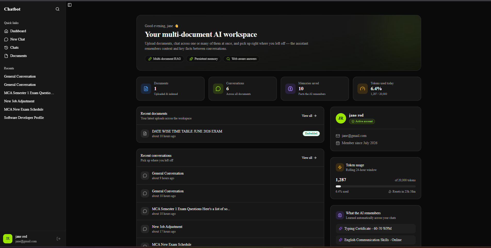
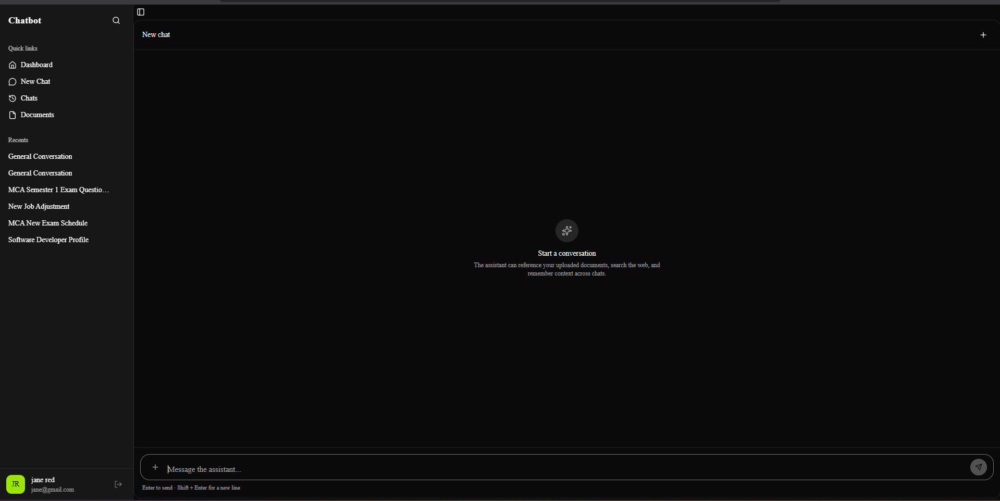
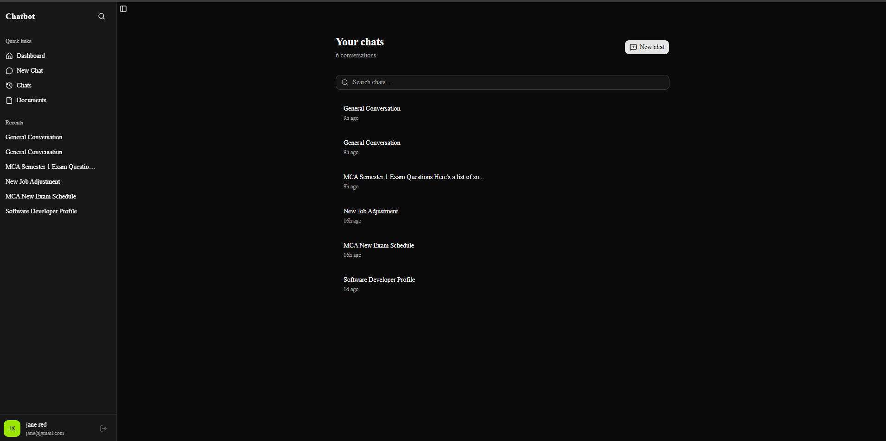
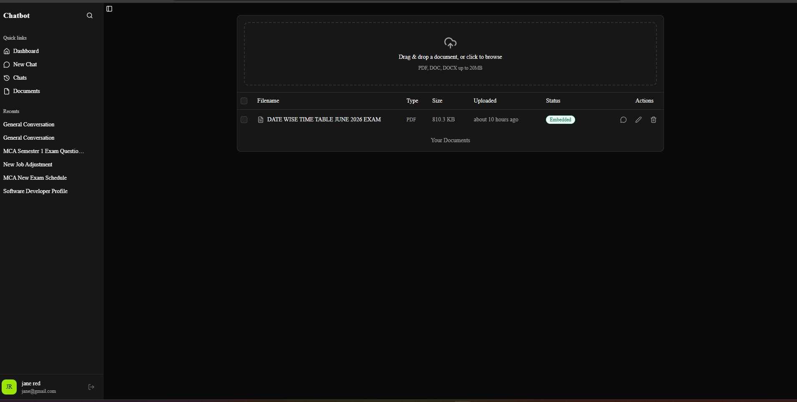
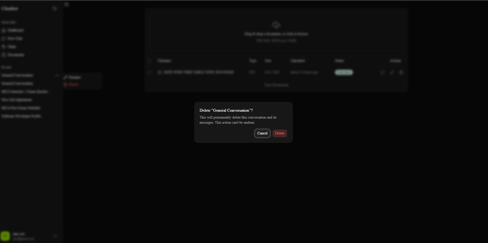

# Multi-Document RAG Chatbot

A full-stack, production-oriented conversational AI application that lets users chat with their own documents. Built with **LangGraph** for agent orchestration, **FastAPI** for the backend, **PostgreSQL** for persistence, **Pinecone** for vector search, and **Next.js** for the frontend.

Live demo: https://multi-document-rag.vercel.app

---

## Screenshots

<table>
  <tr>
    <td align="center"><b>Dashboard</b></td>
    <td align="center"><b>New Chat</b></td>
  </tr>
  <tr>
    <td></td>
    <td></td>
  </tr>
  <tr>
    <td align="center"><b>Chats</b></td>
    <td align="center"><b>Documents</b></td>
  </tr>
  <tr>
    <td></td>
    <td></td>
  </tr>
</table>

<p align="center">
  
  <br/>
  <sub>Document upload / selection modal</sub>
</p>

---

## Features

- **Retrieval-Augmented Generation** - Upload PDFs and ask questions grounded in their actual content, powered by Pinecone vector search over chunked document embeddings.
- **Agentic response routing (LangGraph)** - Each message is routed through a graph that decides, per turn, whether to search attached documents, fall back to a live web search (DuckDuckGo), or answer directly from the model.
- **Persistent conversations** - Conversation state is checkpointed per thread in Postgres via LangGraph's checkpointer, so history survives across sessions and server restarts.
- **Long-term memory** - Relevant facts/preferences from a conversation can be extracted and stored across sessions via LangGraph's Store API.
- **Document lifecycle management** - Upload to S3, background text extraction + chunking + vector indexing, with status tracking (`uploaded -> processing -> embedded / failed`).
- **Authentication** - JWT-based auth stored in an httpOnly cookie, with signup/login/logout and per-route rate limiting.
- **Usage tracking** - Per-user token usage metering with rolling time windows.

---

## Tech Stack

**Backend**
- FastAPI (async) - REST API and streaming chat responses
- LangGraph - agent/graph orchestration, checkpointing, long-term memory store
- LangChain + Groq - LLM inference
- Pinecone - vector database for document retrieval
- SQLAlchemy (async) + Alembic - ORM and migrations
- PostgreSQL - conversations, users, documents, token usage
- AWS S3 (via boto3) - raw document storage
- DuckDuckGo Search - web search fallback tool

**Frontend**
- Next.js 16 (App Router) + TypeScript
- Tailwind CSS + shadcn/ui + Radix UI
- Zustand - client state management
- Axios - API client
- React Hook Form + Zod - form handling and validation

**Infrastructure**
- Backend deployed on Render
- Frontend deployed on Vercel
- Database on managed PostgreSQL (AWS RDS)

---

## How It Works

1. A user uploads a PDF - it's stored in S3, and a background task extracts text, chunks it, and indexes the chunks into Pinecone under a per-user namespace.
2. When a user sends a message with one or more documents attached, the LangGraph workflow:
   - Searches Pinecone for relevant chunks scoped to those documents (`rag_search`)
   - If no relevant context is found, falls back to a live web search (`web_search`)
   - Otherwise generates a direct response from the model (`direct_response`)
   - Generates the final answer grounded in whatever context was gathered (`generate_response`)
3. Conversation state is checkpointed after every turn, and noteworthy long-term facts are extracted for future sessions.

---

## Project Structure

```
chatbot/
|-- backend/
|   |-- app/
|   |   |-- core/          # config, database, security, Pinecone client, LangGraph setup
|   |   |-- dependencies/  # FastAPI dependencies (auth, db session)
|   |   |-- graphs/        # LangGraph workflow (chat_graph.py)
|   |   |-- models/        # SQLAlchemy models
|   |   |-- routers/       # API routes (auth, chat, document, user)
|   |   |-- schemas/       # Pydantic request/response schemas
|   |   `-- services/      # document processing, Pinecone indexing/search
|   `-- alembic/           # database migrations
`-- frontend/
    |-- app/                # Next.js App Router pages
    |-- components/         # UI components
    |-- store/               # Zustand stores (auth, chat, documents)
    `-- public/ui/           # screenshots used in this README
```

---

## Getting Started

### Prerequisites
- Python 3.13+
- Node.js 18+
- PostgreSQL 15+
- Accounts/API keys for: Pinecone, Groq, AWS S3

### Backend Setup

```bash
cd backend

# install dependencies (uses uv)
uv sync

# configure environment - create a .env file (see Environment Variables below)

# run database migrations
uv run alembic upgrade head

# start the API server
uv run uvicorn app.main:app --reload
```

The API will be available at `http://127.0.0.1:8000`, with interactive docs at `http://127.0.0.1:8000/docs`.

### Frontend Setup

```bash
cd frontend

npm install

# configure environment - create a .env.local file
# NEXT_PUBLIC_API_URL=http://127.0.0.1:8000

npm run dev
```

The app will be available at `http://localhost:3000`.

---

## Environment Variables

### Backend (`backend/.env`)

| Variable | Description |
|---|---|
| `DATABASE_URL` | Async Postgres connection string (`postgresql+asyncpg://...`) |
| `DATABASE_URL_PSYCOPG` | Sync/psycopg-style Postgres connection string, used by LangGraph's checkpointer |
| `SECRET_KEY` | Secret used to sign JWT access tokens |
| `ALGORITHM` | JWT signing algorithm (e.g. `HS256`) |
| `ACCESS_TOKEN_EXPIRE_MINUTES` | Access token / session cookie lifetime in minutes |
| `GROQ_API_KEY` | API key for Groq-hosted LLM inference |
| `PINECONE_API_KEY` | Pinecone API key |
| `PINECONE_INDEX_NAME` | Pinecone index name |
| `PINECONE_HOST` | Pinecone index host URL |
| `PINECONE_CLOUD` | Pinecone cloud provider (e.g. `aws`) |
| `PINECONE_REGION` | Pinecone region |
| `BUCKET_NAME` | S3 bucket name for document storage |
| `BUCKET_REGION` | S3 bucket region |
| `BUCKET_ACCESS_KEY` | AWS access key with S3 read/write/delete permissions |
| `BUCKET_SECRET_KEY` | AWS secret key |
| `BUCKET_ENDPOINT` | S3 endpoint URL |
| `FRONTEND_URL` | Deployed frontend origin, used for CORS |
| `ENVIRONMENT` | `development` or `production` - controls cookie `secure`/`samesite` behavior |

### Frontend (`frontend/.env.local`)

| Variable | Description |
|---|---|
| `NEXT_PUBLIC_API_URL` | Base URL of the backend API |

---

## License

This project is available for personal and portfolio use.